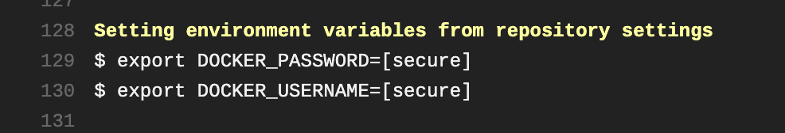
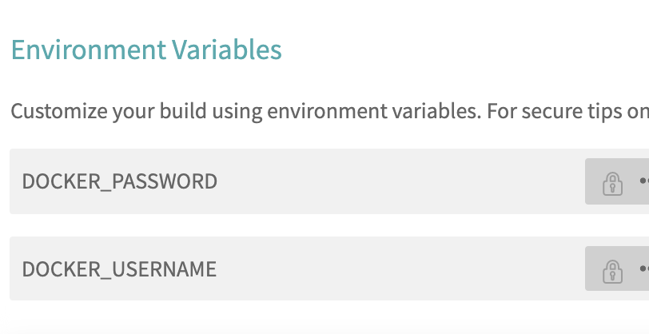

## IBM Unicorn Landing Page

### Setting up your Docker Env Vars 

You can use your GitHub auth token, or just username/password, once logged in set the `env vars`: 

```bash
travis env set DOCKER_USERNAME username
travis env set DOCKER_PASSWORD pwd
```
You should see this in your build at some point, this is reassurance your `env vars` got saved.



> Travis CI confirming that our `env vars` are safe and secure while it builds. 

For some setting the `env vars` in the CLI is the best option, but for others using the Travis CI user interface is easier, and quicker. Click Settings -> Environment Variables then add your `DOCKER` env vars. 



> We are using the UI to enter the Travis CI env vars (rather than the CLI).


### Your `.travis.yml` setup 

```yaml
---
language: shell
sudo: required
dist: xenial
os: linux

services:
  - docker

addons:
  apt:
    packages:
      - docker-ce

env:
  - DEPLOY=false repo=lucashalbert/curl docker_archs="amd64 ppc64le s390x"

install:
  - docker run --rm --privileged multiarch/qemu-user-static --reset -p yes

before_script:
  - export ver=$(curl -s "https://pkgs.alpinelinux.org/package/edge/main/x86_64/curl" | grep -A3 Version | grep href | sed 's/<[^>]*>//g' | tr -d " ")
  - export build_date=$(date -u +"%Y-%m-%dT%H:%M:%SZ")
  - export vcs_ref=$(git rev-parse --short HEAD)

  # Montana's crucial workaround
  
script:
  - chmod u+x ./travis.sh
  - export DOCKER_CLI_EXPERIMENTAL=enabled

after_success:
  - docker images
  - docker manifest inspect --verbose lucashalbert/curl # multiarch build
  - docker manifest inspect --insecure lucashalbert/curl # multiarch build 
  - docker manifest inspect --verbose ppc64le/node # IBM power build 
  - docker manifest inspect --insecure ppc64le/node # IBM power build 
  - docker manifest inspect --verbose s390x/python # IBM Z build 
  - docker manifest inspect --insecure s390x/python # IBM z build
  - docker manifest inspect --verbose ibmjava:jre # official Docker IBM Java (Multiarch) build
  - docker manifest inspect --insecure ibmjava:jre # official Docker IBM Java (Multiarch) build

branches:
  only:
    - master
  except:
    - /^*-v[0-9]/
    - /^v\d.*$/
    
    # .travis.yml created by Montana Mendy for Travis CI & IBM
```

Once you run this `.travis.yml` file, you can inspect the manifests, of `ppc64le` and `s390x`, along with multiarch builds.

